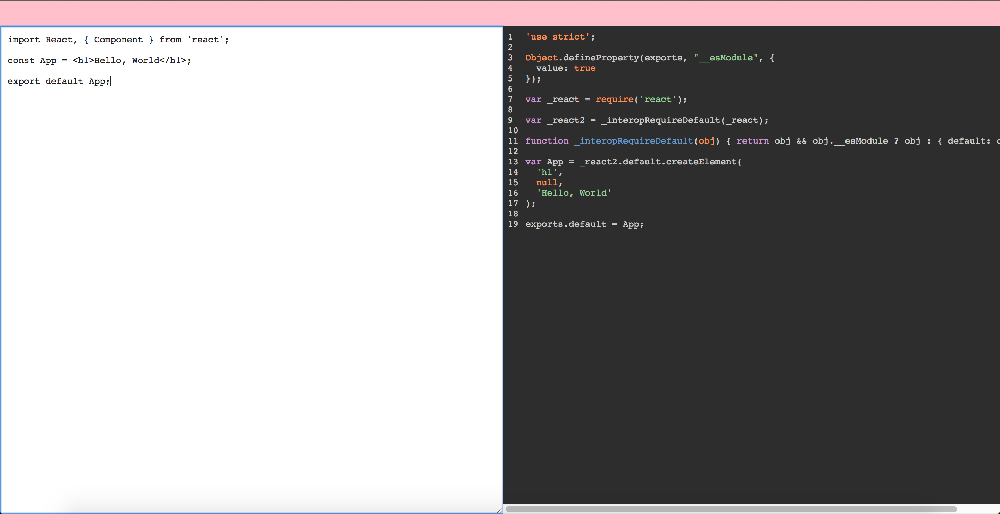
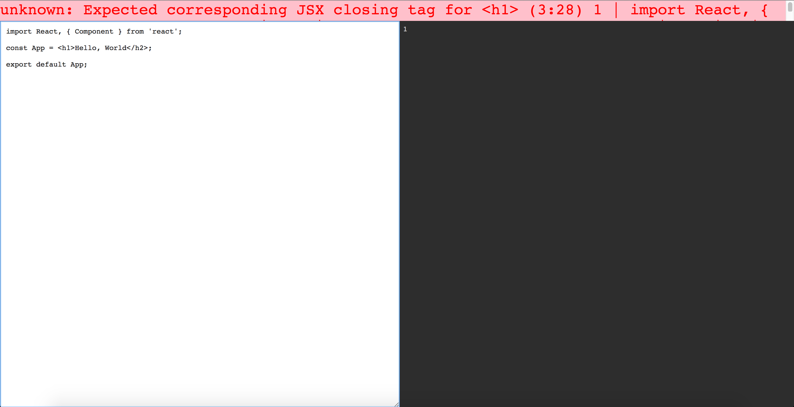

# jsx-live-transpiler

A code editor that transpile your **ES2016 + React + JSX** code to **ES5**.

> Inspired by [Joe Maddalone tutorial available on Egghead](https://egghead.io/lessons/build-a-jsx-live-compiler) - Check it out!

## Usage

Type the command below and have fun!

`$ yarn start`

## Examples

### Without errors

### With errors

